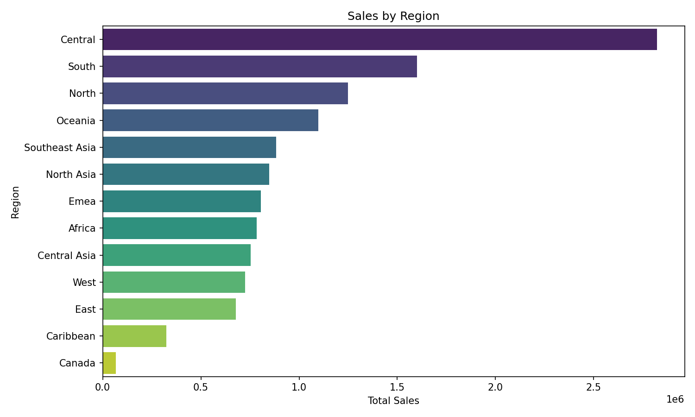
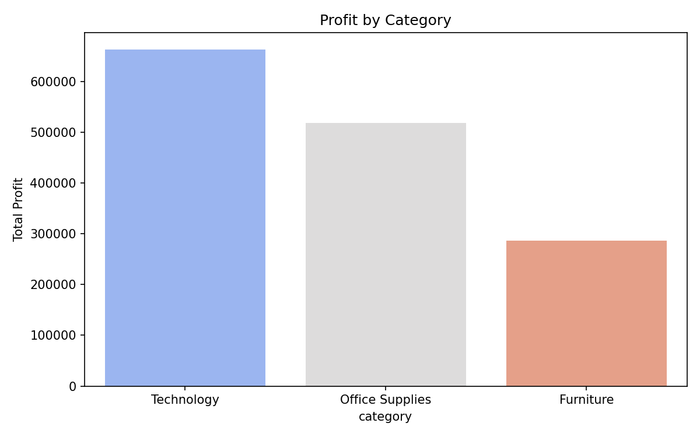
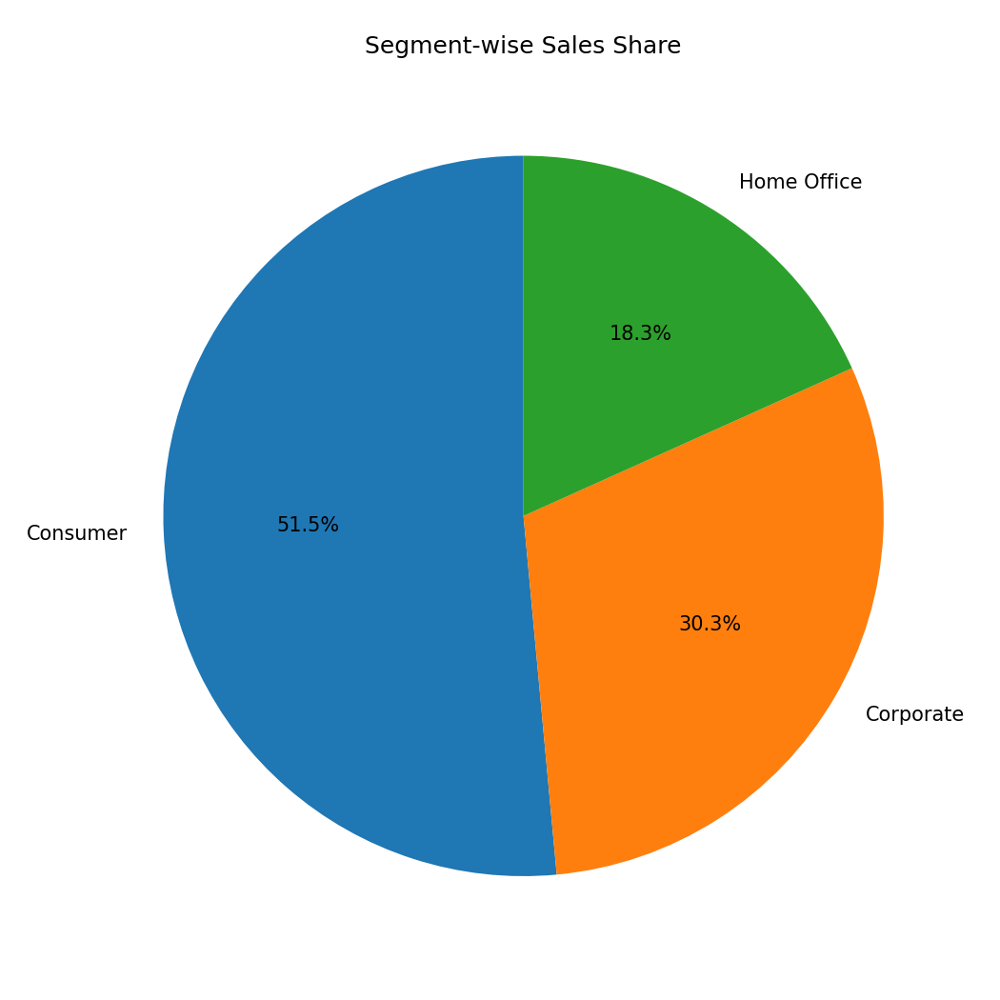
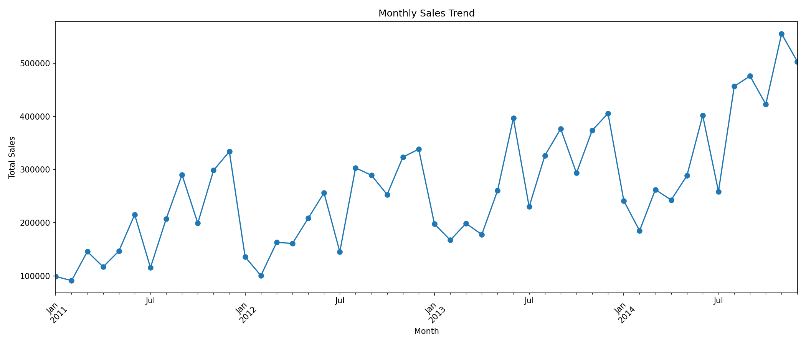

# Pivot Table & Charts Report — Superstore Dataset

## Overview

Built core visualizations on top of the cleaned dataset 
(data/Cleaned_data.csv). Exploration is in notebooks/03_pivot_charts.ipynb; 
the reusable chart-generation script is src/03_pivot_charts.py. Matching 
pivot tables and charts were also built in Excel as a separate deliverable 
for internship submission (not included here — see note at the bottom).

Chart images are saved to reports/figures/ and are safe to publish, since 
they show aggregated patterns only, not row-level company data.

---

## 1. Sales by Region

**Insight:** Central is the clear leader in total sales, at roughly 2.8M — 
close to double the next-highest region (South, ~1.6M) and more than 
double North (~1.25M). After the top three, sales taper off gradually 
across a large group of mid-tier regions (Oceania, Southeast Asia, North 
Asia, EMEA, Africa, Central Asia, West, East) all clustered between 
roughly 0.65M and 1.1M — no single region dominates this middle group. 
Caribbean and Canada are far behind the rest, with Canada barely 
registering (~0.05M), suggesting either a very small market presence 
there or a limited number of stores/customers being served in that region. 
The steep drop from Central to everything else is the single most 
important pattern here — it's worth investigating in a future task 
whether this is due to more customers, larger average order sizes, or 
simply more orders overall in Central.

---

## 2. Profit by Category

**Insight:** Technology generates the highest total profit (~660K), 
followed by Office Supplies (~515K), with Furniture trailing well behind 
at roughly 285K — less than half of Technology's profit. This is a 
meaningful signal: Furniture is likely a high-cost, high-discount, or 
low-margin category compared to the other two. This should be checked 
directly against Day 2's profit-margin-by-category numbers — if Furniture 
also had the weakest margin percentage there, it confirms this isn't just 
a volume issue but a structural profitability problem with that category, 
possibly tied to shipping costs (furniture is typically bulkier/costlier 
to ship) or heavier discounting to move inventory.

---

## 3. Segment-wise Sales

**Insight:** Consumer is the dominant segment, contributing 51.5% of 
total sales — more than Corporate (30.3%) and Home Office (18.3%) 
combined is close but not quite (48.6% combined), meaning Consumer alone 
outweighs the other two segments together. This tells us the business is 
heavily reliant on individual/consumer buyers rather than business 
accounts. The follow-up question this raises: does Consumer's 51.5% 
share of sales translate into a similarly large share of profit, or does 
this segment carry thinner margins (common in consumer retail vs B2B 
corporate contracts)? This should be checked against Day 2's 
segment-wise profit numbers — if Corporate or Home Office show a 
disproportionately higher profit share relative to their smaller sales 
share, it would suggest the business is more profitable per sale in 
those segments, even though Consumer drives more raw volume.

---

## 4. Monthly Sales Trend

**Insight:** The data spans January 2011 through late 2014/2015, and 
shows two clear patterns layered on top of each other:

1. **Strong overall upward trend** — the lowest points in each year rise 
   progressively (the early-2011 trough is near 100K, while by 2014 the 
   troughs sit closer to 250K–300K), and the yearly peaks climb from 
   roughly 330K in 2011 to over 550K by late 2014/2015.
2. **Repeating seasonal cycle within each year** — sales consistently dip 
   in January, then build with volatility through the year, and spike 
   toward the last few months (Q4), before dropping again the following 
   January. This is a classic retail seasonality pattern, likely tied to 
   holiday/year-end purchasing.

Together, this means the business isn't just growing steadily — it's 
growing while retaining a consistent seasonal rhythm year over year, 
which is useful for forecasting: any future sales prediction model should 
account for both the upward trend and the recurring seasonal dips/peaks, 
rather than treating month-to-month swings as noise.

---

## Cross-Chart Observations

- Central region's outsized share of sales (chart 1) combined with 
  Technology's outsized share of profit (chart 2) raises a natural 
  follow-up: is Central also the top region *specifically* for Technology 
  sales, or is Central's lead driven by a different, lower-margin 
  category? This kind of region x category breakdown would be a strong 
  next-step analysis.
- Consumer's dominant sales share (chart 3) combined with the strong Q4 
  seasonal spikes (chart 4) is consistent with typical consumer holiday 
  shopping behavior — worth checking whether the Q4 spike is 
  disproportionately driven by the Consumer segment specifically, or 
  spread evenly across all three segments.

---

## Notes

- All charts use data/Cleaned_data.csv, the output of the Day 1 cleaning 
  pipeline — not raw data.
- Monthly trend uses order_date grouped by calendar month across all 
  years in the dataset.
- Matching pivot tables and charts were built manually in Excel 
  (PivotTable + PivotChart) as a separate submission for the internship's 
  own requirements. The Excel file is not included in this repository 
  since its underlying pivot source data includes the full raw dataset — 
  only the aggregated PNG charts here are safe to publish.

---

## How to Reproduce

python src/03_pivot_charts.py --input data/Cleaned_data.csv --outdir reports/figures